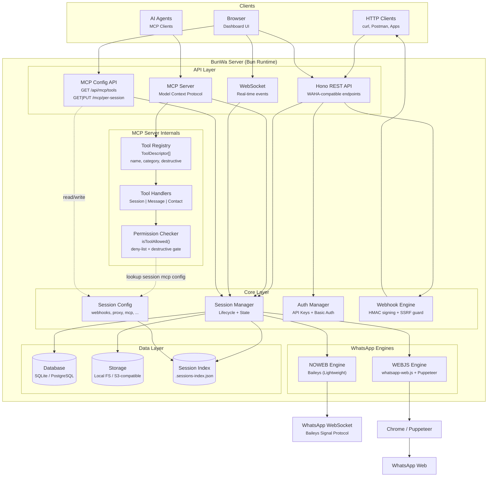

<div align="center">
  
  <h1>BunWa</h1>
  <p><strong>WhatsApp HTTP API — Blazing-fast, Bun-powered alternative to WAHA</strong></p>

  <!-- Badges -->
  
  
  
  
  <br />
  <a href="https://selar.com/showlove/loopyoratory">
    
  </a>
</div>

---

**BunWa** is a WhatsApp HTTP API server built on the [Bun](https://bun.sh) runtime with [Hono](https://hono.dev). It is a 1:1 API-compatible rewrite of WAHA (WhatsApp HTTP API) that delivers the same functionality at significantly lower resource usage.

Two WhatsApp engines are supported:
- **NOWEB** (default) — Uses [Baileys](https://github.com/WhiskeySockets/Baileys), lightweight, no browser required, faster
- **WEBJS** — Uses [whatsapp-web.js](https://github.com/pedroslopez/whatsapp-web.js) with Chrome/Puppeteer, full WhatsApp Web parity

## ✨ Features

- **🚄 Fast** — Bun runtime, batch-loaded auth state, no cold starts
- **🔌 Dual Engine** — NOWEB or WEBJS, choose per session
- **📱 Phone Pairing** — QR code scan or phone number pairing
- **🔧 REST API** — Full WAHA-compatible API surface
- **🌐 Webhooks** — Event-driven with HMAC signing + SSRF protection
- **🛡️ Auth** — API key authentication + dashboard login + policy-based access control
- **☁️ Storage** — Local filesystem or S3-compatible object storage
- **🗄️ Database** — SQLite (via `bun:sqlite`) or PostgreSQL
- **🧩 MCP Server** — Model Context Protocol endpoint for AI agents
- **📊 Dashboard** — React + shadcn/ui dashboard with real-time chat
- **📱 Mobile-first** — Responsive UI built for mobile

## 🚀 Quick Start

```bash
# Clone and enter
git clone <your-repo-url> bunwa
cd bunwa

# Install dependencies
bun install

# Copy and configure environment
cp .env.example .env
# Edit .env with your settings

# Start the server
bun run src/main.ts
```

The dashboard opens at **http://localhost:3001** — the default login is `admin` / `admin` (change in `.env`).

### Docker

```bash
docker run -d \
  --name bunwa \
  -p 3000:3000 \
  -v $(pwd)/.sessions:/app/.sessions \
  -v $(pwd)/.env:/app/.env \
  bunwa:latest
```

## 📸 Dashboard

A full-featured web dashboard built with React 19, shadcn/ui, and Tailwind CSS:

| Page | Description |
|------|-------------|
| **Dashboard** | Sessions overview, worker status, quick actions |
| **Sessions** | Create, start, stop, restart, delete sessions |
| **Chat** | Real-time messaging with reactions, status icons, file sharing |
| **Apps** | Webhook integrations with external services |
| **Logs** | Live log streaming with filtering |
| **Events** | Real-time WebSocket event monitor |
| **Infrastructure** | Database, storage, and server configuration |
| **Templates** | Reusable message templates with dynamic variables |
| **Workers** | Multi-instance worker management |
| **API Docs** | Interactive OpenAPI/Swagger documentation |

## 🔧 Configuration

### Server

| Variable | Default | Description |
|----------|---------|-------------|
| `WHATSAPP_API_PORT` | `3001` | HTTP server port |
| `WHATSAPP_API_KEY` | — | API key for programmatic access |
| `DASHBOARD_USERNAME` | `admin` | Dashboard login username |
| `DASHBOARD_PASSWORD` | `admin` | Dashboard login password |
| `LOG_LEVEL` | `info` | Logging verbosity (`debug`, `info`, `warn`, `error`) |
| `MCP_ENABLED` | `true` | Enable the MCP server at `POST /mcp` |

### Database

| Variable | Default | Description |
|----------|---------|-------------|
| `WAHA_DB_TYPE` | `sqlite` | Database driver (`sqlite` or `postgres`) |
| `WAHA_SQLITE_PATH` | `.sessions/waha.db` | SQLite database file path |
| `WAHA_DATABASE_URL` | — | PostgreSQL connection URL (required when `WAHA_DB_TYPE=postgres`) |

### Storage (Session Auth Data)

| Variable | Default | Description |
|----------|---------|-------------|
| `WAHA_STORAGE_TYPE` | `local` | Storage backend (`local` or `s3`) |
| | | |
| **Local** | | |
| `WAHA_LOCAL_PATH` | `.sessions` | Directory for session auth files |
| | | |
| **S3** | | |
| `WAHA_S3_ENDPOINT` | — | S3-compatible endpoint URL (e.g. MinIO) |
| `WAHA_S3_BUCKET` | `waha-bun` | Bucket name |
| `WAHA_S3_REGION` | `us-east-1` | AWS region |
| `WAHA_S3_ACCESS_KEY` | — | Access key ID |
| `WAHA_S3_SECRET_KEY` | — | Secret access key |

### WhatsApp Session

| Variable | Default | Description |
|----------|---------|-------------|
| `WHATSAPP_SESSION_NAME` | — | Default session name (optional) |
| `WHATSAPP_DEFAULT_ENGINE` | `noweb` | Default engine (`noweb` or `webjs`) |
| `WHATSAPP_WEBJS_CHROME_PATH` | — | Custom Chrome/Chromium path for WEBJS engine |

## 📡 API

BunWa is **100% API compatible** with WAHA (WhatsApp HTTP API).

```bash
# Create a session
curl -X POST http://localhost:3001/api/sessions \
  -H "Content-Type: application/json" \
  -d '{"name":"my-session"}'

# Start it
curl -X POST http://localhost:3001/api/sessions/my-session/start

# Send a message
curl -X POST http://localhost:3001/api/sendText \
  -H "Content-Type: application/json" \
  -d '{
    "session": "my-session",
    "chatId": "233501234567@c.us",
    "text": "Hello from BunWa!"
  }'

# Get QR code (for new sessions)
curl http://localhost:3001/api/sessions/my-session
```

Full interactive API docs at **http://localhost:3001/api-docs/** when the server is running.

## 🧩 MCP Server (Model Context Protocol)

BunWa exposes a [Model Context Protocol](https://modelcontextprotocol.io) server at `POST /mcp` — AI assistants can send WhatsApp messages, manage sessions, query chats, and interact with groups through standardized MCP tools.

### Available Tools

| Category | Tools |
|----------|-------|
| **Session** | `SessionList`, `SessionGet`, `SessionStart`, `SessionStop`, `SessionRestart`, `SessionCheckNumber` |
| **Messaging** | `MessageSendText`, `MessageSendImage`, `MessageSendFile`, `MessageSendVoice`, `MessageSendVideo`, `MessageSendLocation`, `MessageSendPoll`, `MessageSendContactVCard`, `MessageSendLinkPreview`, `MessageReply`, `MessageForward`, `MessageReact`, `MessageStar`, `MessageMarkRead`, `MessageStartTyping`, `MessageStopTyping` |
| **Contacts** | `ContactCheckNumber` |

### Per-Session Tool Policies

Every tool can be enabled or disabled per-session from the **Dashboard → Session Settings → MCP Tools** tab:

- **Master toggle** — enable/disable MCP for the session entirely
- **Destructive ops gate** — block all irreversible operations (delete, clear) with a single switch
- **Per-tool toggles** — disable individual tools or entire categories (group, presence, etc.)

### Quick Connect

```bash
# Claude Desktop / Cursor — add to your MCP config
{
  "mcpServers": {
    "bunwa": {
      "url": "http://localhost:3000/mcp",
      "headers": { "X-Api-Key": "your-api-key" }
    }
  }
}

# Or via MCP Inspector
bunx @modelcontextprotocol/inspector http://localhost:3000/mcp

# Hermes Agent — add to ~/.hermes/config.yaml
mcp_servers:
  bunwa:
    url: "http://localhost:3000/mcp"
    headers:
      X-Api-Key: "your-api-key"
```

### List All Tools

```bash
curl http://localhost:3000/api/mcp/tools | jq '.byCategory'
```

## 🏗️ Architecture



## 🛠️ Technology Stack

| Category | Technology |
|----------|-----------|
| **Runtime** | [Bun](https://bun.sh) 1.3+ |
| **API Framework** | [Hono](https://hono.dev) |
| **Database** | SQLite (`bun:sqlite`) or [PostgreSQL](https://www.postgresql.org) |
| **Storage** | Local filesystem or [S3-compatible](https://aws.amazon.com/s3/) (MinIO, R2, etc.) |
| **Frontend** | [React 19](https://react.dev) + [Vite](https://vite.dev) + [shadcn/ui](https://ui.shadcn.com) + [Tailwind CSS](https://tailwindcss.com) |
| **WhatsApp Engine (NOWEB)** | [Baileys](https://github.com/WhiskeySockets/Baileys) |
| **WhatsApp Engine (WEBJS)** | [whatsapp-web.js](https://github.com/pedroslopez/whatsapp-web.js) + Puppeteer/Chrome |
| **WebSockets** | [Hono WS](https://hono.dev/docs/helpers/websocket) + [RxJS](https://rxjs.dev) |
| **Auth** | API key + dashboard Basic Auth |
| **Container** | [Docker](https://docker.com) multi-stage |

## 📖 Documentation

- **Interactive API Docs** — `http://localhost:3001/api-docs/` (Swagger/OpenAPI)
- **Engine Comparison** — `http://localhost:3001/docs` (NOWEB vs WEBJS feature matrix)
- **Phone Pairing** — QR scan or number pairing supported for both engines
- **Proxy Support** — HTTP, HTTPS, SOCKS4, SOCKS5 proxy for WhatsApp connections

## ⭐ Support

If BunWa helps you, consider supporting the project:

<div align="center">
  <a href="https://selar.com/showlove/loopyoratory">
    
  </a>
  <br /><br />
  <a href="#">
    
  </a>
</div>

---

## 📄 License

### Project License (MIT)

Copyright © 2026

Permission is hereby granted, free of charge, to any person obtaining a copy of this software and associated documentation files (the "Software"), to deal in the Software without restriction, including without limitation the rights to use, copy, modify, merge, publish, distribute, sublicense, and/or sell copies of the Software, and to permit persons to whom the Software is furnished to do so, subject to the following conditions:

The above copyright notice and this permission notice shall be included in all copies or substantial portions of the Software.

THE SOFTWARE IS PROVIDED "AS IS", WITHOUT WARRANTY OF ANY KIND, EXPRESS OR IMPLIED.

### Third-Party Licenses & Attributions

BunWa builds on several open-source projects. We are grateful for their work:

| Dependency | License | Notes |
|------------|---------|-------|
| [Bun](https://bun.sh) | MIT + OSL-3.0 | JavaScript runtime |
| [Hono](https://hono.dev) | MIT | Web framework |
| [Baileys](https://github.com/WhiskeySockets/Baileys) | MIT | WhatsApp WebSocket library (NOWEB engine) |
| [whatsapp-web.js](https://github.com/pedroslopez/whatsapp-web.js) | Apache-2.0 | WhatsApp Web client (WEBJS engine) |
| [React](https://react.dev) | MIT | Frontend UI library |
| [shadcn/ui](https://ui.shadcn.com) | MIT | UI component library |
| [Tailwind CSS](https://tailwindcss.com) | MIT | CSS framework |
| [RxJS](https://rxjs.dev) | Apache-2.0 | Reactive extensions |
| [AWS SDK v3](https://github.com/aws/aws-sdk-js-v3) | Apache-2.0 | S3 storage integration |
| [class-validator](https://github.com/typestack/class-validator) | MIT | Request validation |
| [tsyringe](https://github.com/microsoft/tsyringe) | MIT | Dependency injection |

This project originated as a fork of [WAHA](https://waha.devlike.pro/) (WhatsApp HTTP API) and has been independently developed and optimized for the Bun runtime.

---

<div align="center">
  <sub>Built with ❤️ using <a href="https://bun.sh">Bun</a> + <a href="https://hono.dev">Hono</a></sub>
  <br />
  <sub>WhatsApp HTTP API Server</sub>
</div>
