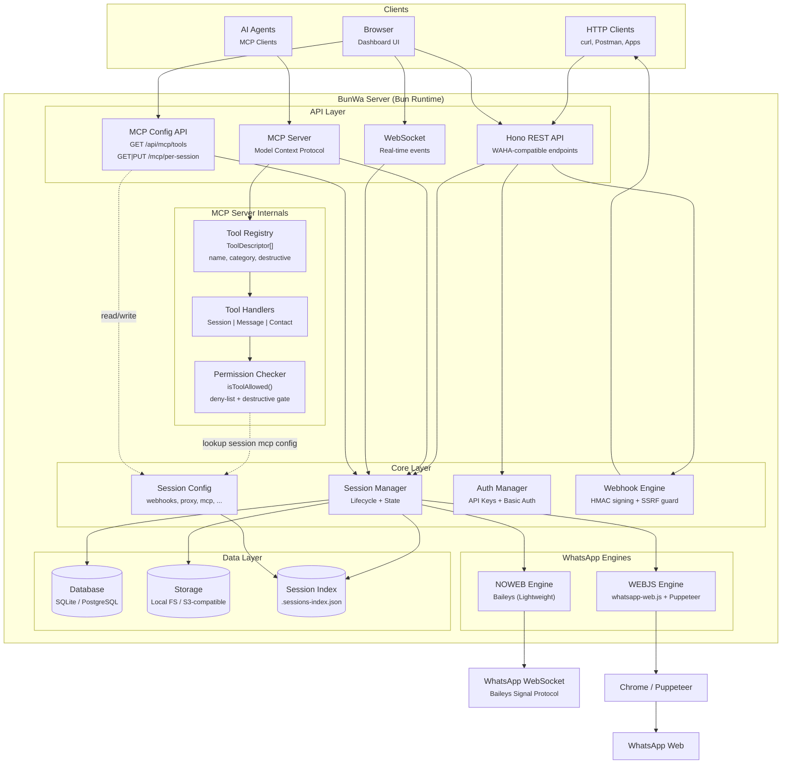

<div align="center">
  
  <h1>BunWa</h1>
  <p><strong>WhatsApp HTTP API — Blazing-fast, Bun-powered alternative to WAHA</strong></p>

  <!-- Badges -->
  
  
  
  
  <br />
  <a href="https://selar.com/showlove/loopyoratory">
    
  </a>
</div>

---

**BunWa** is a WhatsApp HTTP API server built on the [Bun](https://bun.sh) runtime with [Hono](https://hono.dev). It is a 1:1 API-compatible rewrite of WAHA (WhatsApp HTTP API) that delivers the same functionality at significantly lower resource usage.

Two WhatsApp engines are supported:
- **NOWEB** (default) — Uses [Baileys](https://github.com/WhiskeySockets/Baileys), lightweight, no browser required, faster
- **WEBJS** — Uses [whatsapp-web.js](https://github.com/pedroslopez/whatsapp-web.js) with Chrome/Puppeteer, full WhatsApp Web parity

## ✨ Features

- **🚄 Fast** — Bun runtime, batch-loaded auth state, no cold starts
- **🔌 Dual Engine** — NOWEB (Baileys) or WEBJS (whatsapp-web.js + Chrome), choose per session
- **📱 Phone Pairing** — QR code scan or phone number pairing
- **🔧 REST API** — Full WAHA-compatible API surface
- **🌐 Webhooks** — Event-driven with HMAC signing + SSRF protection
- **🛡️ Auth** — API key + dashboard login + per-session MCP keys + policy-based access control
- **☁️ Storage** — Local filesystem or S3-compatible object storage
- **🗄️ Database** — SQLite (via `bun:sqlite`) or PostgreSQL with transaction support
- **🧩 MCP Server** — Model Context Protocol with 23 tools, stdio + HTTP transports, per-session keys
- **📊 Dashboard** — React + shadcn/ui dashboard with real-time chat, MCP key management
- **📱 Mobile-first** — Responsive UI built for mobile
- **🐳 Docker** — Multi-stage builds, Coolify-ready, ~200MB runtime image

## 🚀 Quick Start

```bash
# Clone and enter
git clone https://github.com/LoopyOratory/BunWa.git bunwa
cd bunwa

# Install dependencies (skips Puppeteer Chromium download — use system Chrome for WEBJS)
PUPPETEER_SKIP_DOWNLOAD=true bun install

# Copy and configure environment
cp .env.example .env
# Edit .env — at minimum set WAHA_API_KEY for production

# Start the server
bun run src/main.ts
```

The dashboard opens at **http://localhost:3000** — the default login is `admin` / `admin` (change via `WAHA_DASHBOARD_USERNAME` / `WAHA_DASHBOARD_PASSWORD` in `.env`).

> **Production:** set `WAHA_API_KEY` to a strong random value and `WAHA_ALLOW_NO_AUTH=false`.
> Without either, the API, dashboard, WebSocket, and MCP endpoint are reachable **without
> authentication**.

### Docker

```bash
# Build the image
docker build -t bunwa:latest .

# Run (NOWEB — no Chrome needed)
docker run -d \
  --name bunwa \
  -p 3000:3000 \
  -v $(pwd)/.sessions:/app/.sessions \
  -v $(pwd)/.env:/app/.env \
  bunwa:latest

# Run (WEBJS — mount Chrome binary and set CHROME_PATH)
docker run -d \
  --name bunwa-webjs \
  -p 3000:3000 \
  -v $(pwd)/.sessions:/app/.sessions \
  -v $(pwd)/.env:/app/.env \
  -e CHROME_PATH=/usr/bin/google-chrome \
  bunwa:latest
```

### Coolify

BunWa includes a Coolify-optimized Dockerfile. In Coolify:

1. **New Resource → Application**
2. Connect your Git repo (or paste the URL)
3. **Build Pack:** `Dockerfile`
4. **Dockerfile Target:** `Dockerfile.coolify`
5. Set the port to **3000**
6. Add environment variables in the Coolify UI (`WAHA_API_KEY`, `WAHA_ALLOW_NO_AUTH=false`, etc.)

The Coolify image is smaller (pre-built frontend, no dev deps) and includes a health check.

## 📸 Dashboard

A full-featured web dashboard built with React 19, shadcn/ui, and Tailwind CSS:

| Page | Description |
|------|-------------|
| **Dashboard** | Sessions overview, worker status, quick actions |
| **Sessions** | Create, start, stop, restart, delete sessions |
| **Chat** | Real-time messaging with reactions, status icons, file sharing |
| **Session Settings** | Engine selection (NOWEB/WEBJS), proxy, webhooks, MCP tool policies, **MCP key generation** |
| **Apps** | Webhook integrations with external services (Chatwoot) |
| **Logs** | Live log streaming with filtering |
| **Events** | Real-time WebSocket event monitor |
| **Infrastructure** | Database, storage, and server configuration |
| **API Docs** | Interactive OpenAPI/Swagger documentation |

## 🔧 Configuration

All configuration is via environment variables. Copy [`.env.example`](.env.example) to `.env`
and edit — that file is the canonical source and mirrors every variable below. All variables
are optional and fall back to the defaults shown; booleans accept `true/false/1/0/yes/no`.

> **Production note:** set `WAHA_API_KEY` and `WAHA_ALLOW_NO_AUTH=false`. With neither set,
> the API, dashboard, WebSocket, and MCP endpoint are reachable **without authentication**.

### Server

| Variable | Default | Description |
|----------|---------|-------------|
| `PORT` | `3000` | HTTP port. Takes precedence over `WHATSAPP_API_PORT`. |
| `WHATSAPP_API_PORT` | `3000` | Fallback port if `PORT` is unset. |
| `WHATSAPP_API_SCHEMA` | `http` | URL scheme (`http` or `https`). |
| `WHATSAPP_API_HOSTNAME` | `localhost` | Server hostname. |
| `WAHA_BASE_URL` | — | Override the auto-generated `schema://hostname:port` base URL. |
| `TRUSTED_PROXIES` | — | Comma-separated trusted proxy IPs. When set, the rate limiter reads `x-forwarded-for` for client IP. |
| `WAHA_CORS_ORIGIN` | — | Comma-separated CORS origins. When set, credentialed CORS is enabled for those origins; empty = wildcard, no credentials. |

### Authentication

| Variable | Default | Description |
|----------|---------|-------------|
| `WAHA_API_KEY` | — | API key for programmatic access (header `X-Api-Key`). **Strongly recommended.** |
| `WAHA_ALLOW_NO_AUTH` | `true` | When `false`, requests without an API key are rejected. **Set `false` in production.** |
| `WHATSAPP_API_KEY_EXCLUDE_PATH` | — | Comma-separated API paths excluded from API-key auth (e.g. `/api/health,/api/version`). |

### Dashboard

| Variable | Default | Description |
|----------|---------|-------------|
| `WAHA_DASHBOARD_ENABLED` | `true` | Enable/disable the web dashboard UI. |
| `WAHA_DASHBOARD_USERNAME` | `admin` | Dashboard Basic Auth username. |
| `WAHA_DASHBOARD_PASSWORD` | `admin` | Dashboard Basic Auth password. |

### API Docs (Swagger / Scalar)

| Variable | Default | Description |
|----------|---------|-------------|
| `WHATSAPP_SWAGGER_ENABLED` | `true` | Enable the interactive API docs at `/api-docs`. |
| `WHATSAPP_SWAGGER_USERNAME` | `admin` | API-docs Basic Auth username. |
| `WHATSAPP_SWAGGER_PASSWORD` | — | API-docs Basic Auth password (empty = no auth). |
| `WHATSAPP_SWAGGER_TITLE` | `BUNWA - WhatsApp HTTP API` | API-docs page title. |
| `WHATSAPP_SWAGGER_DESCRIPTION` | — | API-docs description. |
| `WHATSAPP_SWAGGER_EXTERNAL_DOC_URL` | `https://bunwa.ekosystems.dev/` | External docs URL shown in the API docs. |
| `WHATSAPP_SWAGGER_CONFIG_ADVANCED` | `false` | Enable advanced Swagger config options. |

### Logging

| Variable | Default | Description |
|----------|---------|-------------|
| `WAHA_LOG_LEVEL` | `info` | Log level: `trace`, `debug`, `info`, `warn`, `error`, `fatal`. |
| `WAHA_HTTP_LOG_LEVEL` | `info` | HTTP request log level. |
| `WAHA_LOG_FORMAT` | `PRETTY` | Log output format: `PRETTY` or `JSON`. |
| `DEBUG` | — | Set to `1` for verbose Baileys debug output. |
| `WAHA_DEBUG_MODE` | `false` | Enable extra diagnostics. |

### WhatsApp Engine

| Variable | Default | Description |
|----------|---------|-------------|
| `WHATSAPP_DEFAULT_ENGINE` | `NOWEB` | Default engine: `NOWEB` (Baileys) or `WEBJS` (whatsapp-web.js). |
| `ENGINE_TYPE` | — | Alternative engine-type override. |
| `WAHA_NAMESPACE` / `WAHA_SESSION_NAMESPACE` | engine name | Namespace prefix for session names. |
| `CHROME_PATH` / `PUPPETEER_EXECUTABLE_PATH` | — | Path to Chrome/Chromium binary (**required for the WEBJS engine**). |
| `WAHA_PRINT_QR` | `true` | Set `false` to suppress QR output in the console. |

> ⚠️ The **WEBJS engine requires Chrome/Chromium** installed on the host (set via `CHROME_PATH`
> or `PUPPETEER_EXECUTABLE_PATH`). The engine will fail with a clear error if Chrome is
> missing — it never crashes with a raw module-not-found error.

### Client Config (NOWEB)

| Variable | Default | Description |
|----------|---------|-------------|
| `WAHA_CLIENT_DEVICE_NAME` | — | Device name shown to WhatsApp. |
| `WAHA_CLIENT_BROWSER_NAME` | — | Browser name shown to WhatsApp. |

### Session Management

| Variable | Default | Description |
|----------|---------|-------------|
| `WHATSAPP_START_SESSION` | — | Comma-separated session names to auto-start on boot. |
| `WHATSAPP_RESTART_ALL_SESSIONS` | `false` | Restore and start all previously-running sessions on boot. |
| `WAHA_AUTO_START_DELAY_SECONDS` | `0` | Delay before auto-starting sessions. |
| `WAHA_WORKER_ID` | — | Worker ID for multi-worker deployments. |
| `WAHA_WORKER_RESTART_SESSIONS` | `true` | Worker restores sessions on start. |
| `WAHA_VERSION` | auto | Version override: `CORE` or `PLUS`. |

### Presence

| Variable | Default | Description |
|----------|---------|-------------|
| `WAHA_PRESENCE_AUTO_ONLINE` | `true` | Mark session ONLINE on any message activity. |
| `WAHA_PRESENCE_AUTO_ONLINE_DURATION_SECONDS` | `25` | Seconds to keep ONLINE after activity. |

### Chat Filtering (global defaults)

These set the **server-wide** ignore defaults. (Per-session ignore toggles in the dashboard
are not yet applied by the engine — see [`plans/`](plans/).)

| Variable | Default | Description |
|----------|---------|-------------|
| `WAHA_SESSION_CONFIG_IGNORE_STATUS` | `false` | Ignore status/list messages. |
| `WAHA_SESSION_CONFIG_IGNORE_GROUPS` | `false` | Ignore group chats. |
| `WAHA_SESSION_CONFIG_IGNORE_CHANNELS` | `false` | Ignore channels. |
| `WAHA_SESSION_CONFIG_IGNORE_BROADCAST` | `false` | Ignore broadcast lists. |

### Database

| Variable | Default | Description |
|----------|---------|-------------|
| `WAHA_DATABASE_DRIVER` | `sqlite` | Driver: `sqlite`, `postgres`, or `mongo`. |
| `WAHA_SQLITE_PATH` | `.sessions/waha.db` | SQLite file path (driver `sqlite`). |
| `WAHA_DATABASE_URL` | — | PostgreSQL connection string (driver `postgres`). |
| `WHATSAPP_SESSIONS_POSTGRESQL_URL` | — | Alias for `WAHA_DATABASE_URL`. |
| `WHATSAPP_SESSIONS_MONGO_URL` | — | MongoDB connection string for session storage. |
| `WAHA_DB_TYPE` | `sqlite` | Database type reported by the infrastructure endpoint. |
| `WAHA_DB_HOST` | `localhost` | Reported DB host. |
| `WAHA_DB_PORT` | `5432` | Reported DB port. |
| `WAHA_DB_USERNAME` | — | Reported DB username. |
| `WAHA_DB_NAME` | `./data/waha.sqlite` | Reported DB name. |
| `WAHA_DB_SSL` | `false` | Reported DB SSL flag. |

### Media

| Variable | Default | Description |
|----------|---------|-------------|
| `WHATSAPP_FILES_FOLDER` | `/tmp/whatsapp-files` | Directory for downloaded media. |
| `WHATSAPP_DOWNLOAD_MEDIA` | `true` | Enable automatic media download. |
| `WHATSAPP_FILES_MIMETYPES` | — | Comma-separated allowed MIME types (empty = all). |
| `WHATSAPP_HEALTH_MEDIA_FILES_THRESHOLD_MB` | `100` | Media-files health threshold (MB). |
| `WHATSAPP_HEALTH_SESSION_FILES_THRESHOLD_MB` | `100` | Session-files health threshold (MB). |

### Storage — Local

| Variable | Default | Description |
|----------|---------|-------------|
| `STORAGE_TYPE` | `local` | Storage backend: `local` or `s3`. |
| `STORAGE_LOCAL_PATH` | `./data/media` | Local media storage path. |
| `WAHA_LOCAL_STORE_BASE_DIR` | `.sessions` | Base directory for session auth data. |
| `WAHA_STORAGE_DIR` | `./data` | Directory for internal databases (audit, templates). |
| `DATA_DIR` | `./data` | General data directory (export/import). |
| `EXPORT_IMPORT_MAX_BACKUPS` | — | Max backup files retained during export/import. |
| `STORAGE_IMPORT_MAX_BYTES` | `209715200` | Per-entry import byte cap (default 200 MiB). |
| `STORAGE_IMPORT_MAX_ENTRIES` | `100000` | Max entries per import. |
| `AUDIT_RETENTION_DAYS` | `90` | Days to retain audit logs (`0` or negative disables). |
| `WAHA_STORAGE_TYPE` / `WAHA_STORAGE_LOCAL_PATH` | — | Legacy aliases for `STORAGE_TYPE` / `STORAGE_LOCAL_PATH`. |

### Storage — S3

Set `STORAGE_TYPE=s3` and configure:

| Variable | Default | Description |
|----------|---------|-------------|
| `S3_ENDPOINT` | — | S3-compatible endpoint URL (e.g. MinIO). |
| `S3_ACCESS_KEY_ID` | — | Access key ID. |
| `S3_SECRET_ACCESS_KEY` | — | Secret access key. |
| `S3_ACCESS_KEY` / `S3_SECRET_KEY` | — | Legacy credential aliases (read as fallback). |
| `S3_BUCKET` | `waha-bun` | Bucket name. |
| `S3_REGION` | `us-east-1` | Region. |
| `WAHA_S3_ENDPOINT` / `WAHA_S3_BUCKET` / `WAHA_S3_REGION` / `WAHA_S3_ACCESS_KEY` / `WAHA_S3_SECRET_KEY` | — | WAHA-prefixed vars used by the infrastructure endpoint. |

### Webhook

| Variable | Default | Description |
|----------|---------|-------------|
| `WAHA_WEBHOOK_URL` | — | Default webhook URL for all sessions (overridable per session). |
| `WEBHOOK_SSRF_PROTECT` | `true` | Enable SSRF protection for webhook delivery. |
| `SSRF_ALLOWED_HOSTS` | — | Comma-separated hosts/IPs allowed when SSRF protection is on. |

### Proxy

| Variable | Default | Description |
|----------|---------|-------------|
| `WHATSAPP_PROXY_SERVER` | — | Single proxy server (`protocol://host:port`). |
| `WHATSAPP_PROXY_SERVER_LIST` | — | Comma-separated proxy list (overrides the single server). |
| `WHATSAPP_PROXY_SERVER_INDEX_PREFIX` | — | Index prefix for mapping sessions to proxies. |
| `WHATSAPP_PROXY_SERVER_USERNAME` / `WHATSAPP_PROXY_SERVER_PASSWORD` | — | Proxy authentication. |

### Queue / Redis

| Variable | Default | Description |
|----------|---------|-------------|
| `WAHA_QUEUE_ENABLED` | `false` | Redis-backed queue toggle. |
| `WAHA_REDIS_HOST` | `localhost` | Redis host. |
| `WAHA_REDIS_PORT` | `6379` | Redis port. |
| `WAHA_REDIS_PASSWORD` | — | Redis password. |

> ℹ️ These are currently **reported only** by the infrastructure endpoint — there is no active
> queue backend bundled (the queue dependencies were removed). Setting them has no runtime effect yet.

### MCP (Model Context Protocol)

| Variable | Default | Description |
|----------|---------|-------------|
| `MCP_READONLY` | `false` | When `true`, MCP tools operate in read-only mode. |
| `MCP_RATE_LIMIT_MAX` | `60` | Max MCP requests per window. |
| `MCP_RATE_LIMIT_WINDOW_MS` | `60000` | MCP rate-limit window (ms). |

### Chatwoot Integration

| Variable | Default | Description |
|----------|---------|-------------|
| `MILO_API_URL` | `http://localhost:3003/api/webhooks/chatwoot/milo` | Milo API URL for Chatwoot webhook forwarding. |

### Health Check

| Variable | Default | Description |
|----------|---------|-------------|
| `WHATSAPP_HEALTH_MONGO_TIMEOUT_MS` | `3000` | MongoDB health-check timeout (ms). |

## 📡 API

BunWa is **100% API compatible** with WAHA (WhatsApp HTTP API).

```bash
# Create a session
curl -X POST http://localhost:3000/api/sessions \
  -H "Content-Type: application/json" \
  -d '{"name":"my-session"}'

# Start it
curl -X POST http://localhost:3000/api/sessions/my-session/start

# Send a message
curl -X POST http://localhost:3000/api/sendText \
  -H "Content-Type: application/json" \
  -d '{
    "session": "my-session",
    "chatId": "233501234567@c.us",
    "text": "Hello from BunWa!"
  }'

# Get QR code (for new sessions)
curl http://localhost:3000/api/sessions/my-session
```

Full interactive API docs at **http://localhost:3000/api-docs/** when the server is running.

## 🧩 MCP Server (Model Context Protocol)

BunWa exposes a [Model Context Protocol](https://modelcontextprotocol.io) server — AI assistants can send WhatsApp messages, manage sessions, query chats, and interact with groups through 23 standardized MCP tools. **Two transports are supported:** Streamable HTTP (`POST /mcp`) and stdio (subprocess, for local clients).

### Per-Session MCP Keys 🔑

Every session gets its own scoped MCP credential. From the **Dashboard → Session Settings → MCP** tab:

1. Click **Generate MCP Key**
2. Copy the key and the ready-made connection config (stdio or HTTP — each has its own Copy button)
3. Close the dialog — the key is **never shown again**. Only a SHA-256 hash is stored.

Per-session keys are **auto-scoped** — a key for session "support" can never access session "admin," even if the caller sends a different `sessionId`. Regenerate anytime to rotate (invalidates the old key instantly).

### Quick Connect

**stdio (recommended for local use — no network hop, works with all clients):**

```json
{
  "mcpServers": {
    "bunwa-default": {
      "command": "bun",
      "args": ["run", "src/mcp/stdio.ts"],
      "env": {
        "BUNWA_SESSION": "default",
        "BUNWA_MCP_KEY": "sk_mcp_..."
      }
    }
  }
}
```

**HTTP / SSE (for remote or Docker deployments):**

```json
{
  "mcpServers": {
    "bunwa": {
      "url": "http://localhost:3000/mcp",
      "headers": { "X-Api-Key": "sk_mcp_..." }
    }
  }
}
```

The dashboard generates both formats with your real key filled in — copy, paste, done.

### Available Tools

| Category | Tools |
|----------|-------|
| **Session** | `SessionList`, `SessionGet`, `SessionStart`, `SessionStop`, `SessionRestart`, `SessionCheckNumber` |
| **Messaging** | `MessageSendText`, `MessageSendImage`, `MessageSendFile`, `MessageSendVoice`, `MessageSendVideo`, `MessageSendLocation`, `MessageSendPoll`, `MessageSendContactVCard`, `MessageSendLinkPreview`, `MessageReply`, `MessageForward`, `MessageReact`, `MessageStar`, `MessageMarkRead`, `MessageStartTyping`, `MessageStopTyping` |
| **Contacts** | `ContactCheckNumber` |

### Per-Session Tool Policies

Every tool can be enabled or disabled per-session from the **Dashboard → Session Settings → MCP Tools** tab:

- **Master toggle** — enable/disable MCP for the session entirely
- **Destructive ops gate** — block all irreversible operations with a single switch
- **Per-tool toggles** — disable individual tools or entire categories

### Auth Model

| Key type | Scope | How to get one |
|----------|-------|---------------|
| `WAHA_API_KEY` (global) | All sessions, admin | Set in `.env` |
| Per-session `sk_mcp_...` | Single session, auto-scoped | Dashboard → Session Settings → MCP → Generate Key |

Both are accepted by both transports. The global key is always admin. Per-session keys are
validated by hashing the provided key and comparing to the stored SHA-256 hash — plaintext
is never persisted.

### Test the MCP Server

```bash
# List all tools (REST API)
curl http://localhost:3000/api/mcp/tools | jq '.byCategory'

# MCP Inspector (interactive testing)
bunx @modelcontextprotocol/inspector http://localhost:3000/mcp
```

## 🏗️ Architecture



## 🛠️ Technology Stack

| Category | Technology |
|----------|-----------|
| **Runtime** | [Bun](https://bun.sh) 1.3+ |
| **API Framework** | [Hono](https://hono.dev) |
| **Database** | SQLite (`bun:sqlite`) or [PostgreSQL](https://www.postgresql.org) |
| **Storage** | Local filesystem or [S3-compatible](https://aws.amazon.com/s3/) (MinIO, R2, etc.) |
| **Frontend** | [React 19](https://react.dev) + [Vite](https://vite.dev) + [shadcn/ui](https://ui.shadcn.com) + [Tailwind CSS](https://tailwindcss.com) |
| **WhatsApp Engine (NOWEB)** | [Baileys](https://github.com/WhiskeySockets/Baileys) |
| **WhatsApp Engine (WEBJS)** | [whatsapp-web.js](https://github.com/pedroslopez/whatsapp-web.js) + Puppeteer/Chrome |
| **WebSockets** | [Hono WS](https://hono.dev/docs/helpers/websocket) + [RxJS](https://rxjs.dev) |
| **MCP SDK** | [@modelcontextprotocol/sdk](https://github.com/modelcontextprotocol/typescript-sdk) |
| **Auth** | API key + dashboard Basic Auth + per-session MCP keys (SHA-256 hashed) |
| **Container** | [Docker](https://docker.com) multi-stage + [Coolify](https://coolify.io) ready |

## 📖 Documentation

- **Interactive API Docs** — `http://localhost:3000/api-docs/` (Scalar/OpenAPI)
- **Engine Comparison** — `http://localhost:3000/docs` (NOWEB vs WEBJS feature matrix)
- **MCP Connection** — Dashboard → Session Settings → MCP → Generate Key (one-click config generation)
- **Phone Pairing** — QR scan or number pairing supported for both engines
- **Proxy Support** — HTTP, HTTPS, SOCKS4, SOCKS5 proxy for WhatsApp connections
- **CI** — GitHub Actions runs `bun test`, `oxlint`, and a TypeScript error ratchet on every push

## ⭐ Support

If BunWa helps you, consider supporting the project:

<div align="center">
  <a href="https://selar.com/showlove/loopyoratory">
    
  </a>
  <br /><br />
  <a href="#">
    
  </a>
</div>

---

## 📄 License

### Project License (MIT)

Copyright © 2026

Permission is hereby granted, free of charge, to any person obtaining a copy of this software and associated documentation files (the "Software"), to deal in the Software without restriction, including without limitation the rights to use, copy, modify, merge, publish, distribute, sublicense, and/or sell copies of the Software, and to permit persons to whom the Software is furnished to do so, subject to the following conditions:

The above copyright notice and this permission notice shall be included in all copies or substantial portions of the Software.

THE SOFTWARE IS PROVIDED "AS IS", WITHOUT WARRANTY OF ANY KIND, EXPRESS OR IMPLIED.

### Third-Party Licenses & Attributions

BunWa builds on several open-source projects. We are grateful for their work:

| Dependency | License | Notes |
|------------|---------|-------|
| [Bun](https://bun.sh) | MIT + OSL-3.0 | JavaScript runtime |
| [Hono](https://hono.dev) | MIT | Web framework |
| [Baileys](https://github.com/WhiskeySockets/Baileys) | MIT | WhatsApp WebSocket library (NOWEB engine) |
| [whatsapp-web.js](https://github.com/pedroslopez/whatsapp-web.js) | Apache-2.0 | WhatsApp Web client (WEBJS engine) |
| [React](https://react.dev) | MIT | Frontend UI library |
| [shadcn/ui](https://ui.shadcn.com) | MIT | UI component library |
| [Tailwind CSS](https://tailwindcss.com) | MIT | CSS framework |
| [RxJS](https://rxjs.dev) | Apache-2.0 | Reactive extensions |
| [AWS SDK v3](https://github.com/aws/aws-sdk-js-v3) | Apache-2.0 | S3 storage integration |
| [class-validator](https://github.com/typestack/class-validator) | MIT | Request validation |
| [tsyringe](https://github.com/microsoft/tsyringe) | MIT | Dependency injection |

This project originated as a fork of [WAHA](https://waha.devlike.pro/) (WhatsApp HTTP API) and has been independently developed and optimized for the Bun runtime.

---

<div align="center">
  <sub>Built with ❤️ using <a href="https://bun.sh">Bun</a> + <a href="https://hono.dev">Hono</a></sub>
  <br />
  <sub>WhatsApp HTTP API Server</sub>
</div>
